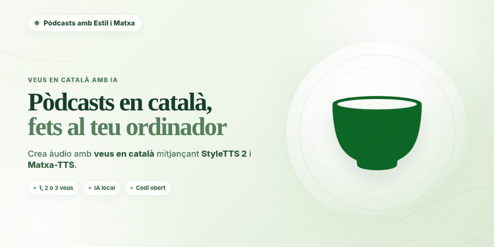

<p align="center">
  
</p>

# 🎙️ Pòdcasts amb Estil i Matxa

> **Aplicació d'escriptori autònoma per a Windows de creació de pòdcasts en català d'una, dues o tres veus, en local i sense límit de durada.**  
> Dissenyada per a materials educatius i divulgatius.  

---

## 📥 Descarrega directa per a Windows (.exe)

Per utilitzar l'aplicació a Windows **sense necessitat d'instal·lar Python ni compilar**:
1. Descarrega el paquet complet de la **versió oficial actualitzada v1.1.0**:
   👉 **[Descarregar PodcastsAmbEstilIMatxa v1.1.0 per a Windows (.zip)](https://github.com/miquelangelfuentes/podcasts-amb-estil-i-matxa/releases/download/v1.1.0/PodcastsAmbEstilIMatxa-v1.1.0-Windows.zip)** (~402 MB)
2. Descomprimeix el fitxer ZIP en una carpeta del teu ordinador.
3. Executa directament `PodcastsAmbEstilIMatxa.exe`.
4. A la barra superior, fes clic a **`📦 Models`** per descarregar els models de síntesi de veu des d'Hugging Face amb un sol clic.

> [!NOTE]
> **Versió actual v1.1.0**: l'arxiu descarregat s'anomena amb el nom i número de la versió actualitzada (`PodcastsAmbEstilIMatxa-v1.1.0-Windows.zip`) i inclou el nou motor UPC Ona FestCat, la pista de música de fons amb bucle i control de volum, el comprovador de versió i el número de versió visible tant a la barra de títol com a la capçalera de l'aplicació.

---

## 🌟 Característiques principals

- **Estructura flexible d'1, 2 o 3 veus**:
  - **1 veu (monòleg)**: càpsules didàctiques i explicacions amb la veu presentadora al centre (`pan=0%`).
  - **2 veus (diàleg)**: converses i entrevistes naturals entre dues veus interlocutores (`-25%` i `+25%`, sense presentador).
  - **3 veus (tertúlia)**: taules rodones amb veu presentadora al centre (`pan=0%`) i dues veus col·laboradores als laterals (`-25%` i `+25%`).
- **Sense límit de durada**: genera des de càpsules breus de 2 minuts fins a lliçons o debats de 30-60 minuts gràcies a la síntesi per blocs oracionals.
- **100% local i privat**: no envia cap dada ni text a internet amb els motors autònoms. Apte per a escoles, instituts i universitats (privadesa total per a docents i alumnat).
- **Models de llengua oberts de Catalunya**:
  - **`BSC-LT/Matxa-TTS-v2-Multiaccent`**: model acústic d'última generació basat en transport òptim i flow matching (100% offline), amb 16 variants dialectals del català (central, balear, valencià, nord-occidental i septentrional).
  - **`UPC FestCat Ona (Piper Neural)`**: veu neuronal d'alta definició de la Universitat Politècnica de Catalunya (100% offline), pes de només 63 MB i gran calidesa acústica.
  - **`projecte-aina/alvocat-vocos-22khz`**: vocoder neuronal Vocos i normalitzador desenvolupat en el marc del Projecte AINA (100% offline).
  - **`Microsoft Neural ca-ES (Online)`**: servei al núvol integrat opcionalment per a síntesi ràpida (veus Joana i Enric).
- **Comprovador d'actualitzacions integrat (`🔄 Comprova versió`)**: verifica directament contra el repositori GitHub si hi ha noves versions o millores i permet actualitzar l'aplicació en un sol clic.
- **Selector directe de motor**: canvi immediat entre Matxa-TTS v2 (offline), UPC Ona (offline) i Microsoft Neural (online) des de la capçalera del panell de locutors.
- **Clonació de veu zero-shot**: clona la veu de qualsevol persona aportant una petita mostra d'àudio en format WAV (5-15 segons).
- **Mostres instantànies de veu (0 ms)**: escolta en directe qualsevol veu catalana amb el botó `▶ Escolta`.
- **Pista de música o so de fons (MP3 / WAV / OGG / FLAC)**:
  - Permet afegir fàcilment una banda sonora, sintonia d'obertura o ambientació sonora de fons al pòdcast.
  - Reproducció automàtica en **bucle continu (*loop*)** amb transició suau (*cross-fade* de 20 ms) per evitar salts bruscos entre repeticions.
  - **Medidor i lliscador de volum** regulable de l'1% al 100% (per defecte al 15% per a màxima claredat vocal) amb botó d'escolta de prova instantània (`▶ Prova` / `■ Atura`).
  - Esvaïment progressiu d'entrada (*fade-in* d'1 s) i sortida (*fade-out* de 2 s), integrat amb limitador suau de pic per evitar saturació digital en la masterització final.
- **Masterització d'estudi i exportació MP3**:
  - Espacialització estèreo (*panning*) per posicionar cada veu a l'estudi sonor.
  - Normalització de sonoritat d'emissió segons l'estàndard **EBU R128 (-16 LUFS)**.
  - Exportació directa a **MP3 estèreo a 160 kbps CBR** (màxima fidelitat per a 22,05 kHz).
- **Interfície responsiva i adaptativa**: suport complet per a escalat DPI a Windows (125% i 150%) amb reproductor d'àudio ancorat a la base i controls desplaçables.
- **Executable independent per a Windows**: distribució autònoma en fitxer `.exe`.

---

## 📂 Estructura del projecte

```
📁 Antigravity/
├── 📄 app.py                     # Punt d'entrada de l'aplicació
├── 📁 core/                      # Motors de processament
│   ├── 📄 script_parser.py       # Analitzador sintàctic del guió .txt
│   ├── 📄 text_normalizer.py     # Normalitzador lingüístic en català (alVoCat)
│   ├── 📄 matxa_tts_engine.py    # Motor Matxa-TTS v2 multiaccent (BSC-LT)
│   ├── 📄 upc_ona_engine.py      # Motor UPC Ona FestCat (Piper Neural 100% offline)
│   ├── 📄 tts_engine.py          # Motor al núvol Microsoft Neural (Edge TTS)
│   ├── 📄 vocoder_alvocat.py     # Vocoder neural Vocos 22kHz (AINA)
│   ├── 📄 voice_preview.py       # Gestor de mostres i memòria cau d'àudio
│   ├── 📄 audio_processor.py     # Panning estèreo, bucle de música, LUFS i MP3
│   ├── 📄 model_downloader.py    # Gestor de descàrrega asíncrona des d'Hugging Face
│   └── 📄 system_checker.py      # Diagnòstic automàtic de maquinari (CPU, GPU, RAM, disc)
├── 📁 ui/                        # Interfície d'usuari (CustomTkinter)
│   ├── 📄 theme.py               # Paleta de colors Te Matxa Pastel
│   ├── 📄 main_window.py         # Finestra principal amb editor i selecció d'1, 2 o 3 veus
│   ├── 📄 components_modal.py    # Gestor visual de models i comprovació del sistema
│   ├── 📄 version_check_modal.py # Comprovador d'actualitzacions i descàrrega GitHub
│   ├── 📄 voice_clone_modal.py   # Modal per a clonació de veu zero-shot
│   └── 📄 player_widget.py       # Reproductor d'àudio i exportador MP3
├── 📁 docs/                      # Guies i documentació
│   ├── 📄 GUIA_PROMPT_LLM.md     # Indicació per a models de llenguatge (ChatGPT/Claude/Gemini)
│   ├── 📄 GUIA_SSML_CATALA.md    # Manual d'opcions SSML i fonètica en català
│   └── 📄 FITXA_DIVULGACIO_DOCENTS.md # Fitxa pedagògica per a docents i comunitat educativa
├── 📁 examples/                  # Recursos didàctics
│   ├── 📄 guio_exemple_5min.txt  # Guió formatiu complet de 5 minuts
│   ├── 📄 plantilla_1veu.txt     # Plantilla d'1 veu (monòleg amb Veu presentadora)
│   ├── 📄 plantilla_2veus.txt    # Plantilla de 2 veus (diàleg sense presentador)
│   └── 📄 plantilla_3veus.txt    # Plantilla de 3 veus (tertúlia amb Veu presentadora)
├── 📁 assets/                    # Icona cerimonial de te matxa i bàner oficial
├── 📄 build_exe.py               # Script de compilació a .exe amb PyInstaller (Windows)
├── 📄 build_exe.bat              # Fitxer per compilar amb un sol clic a Windows
├── 📄 build_linux.py             # Script de compilació per a Linux (x86_64)
├── 📄 run_app.bat                # Llançador directe de l'aplicació per a Windows
├── 📄 run_app.sh                 # Llançador directe de l'aplicació per a Linux
└── 📄 requirements.txt           # Dependències de Python
```

---

## 🚀 Com executar l'aplicació

### 🪟 A Windows
- **Llançament directe (Python)**: fes doble clic a `run_app.bat` o obre una consola PowerShell i executa `py app.py`.
- **Compilació a executable (.exe)**: fes doble clic a `build_exe.bat` o executa `py build_exe.py`. L'executable autònom es generarà a `dist/PodcastsAmbEstilIMatxa/PodcastsAmbEstilIMatxa.exe` i es comprimirà automàticament a `dist/PodcastsAmbEstilIMatxa-v1.1.0-Windows.zip`.

### 🐧 A Linux (Ubuntu, Debian, Linkat, Fedora, Arch, Linux Mint)
1. **Instal·la les dependències de sistema necessàries**:
   - A Debian / Ubuntu / Linkat / Linux Mint:
     ```bash
     sudo apt update && sudo apt install -y python3-tk libsndfile1 espeak-ng python3-venv
     ```
   - A Fedora:
     ```bash
     sudo dnf install python3-tkinter libsndfile espeak-ng
     ```
   - A Arch Linux:
     ```bash
     sudo pacman -S tk libsndfile espeak-ng
     ```
2. **Llançament directe amb l'script**:
   ```bash
   chmod +x run_app.sh
   ./run_app.sh
   ```
   L'script crea automàticament l'entorn virtual `.venv`, instal·la totes les dependències de Python i engega l'aplicació.
3. **Compilació a paquet autònom per a Linux**:
   ```bash
   python3 build_linux.py
   ```
   Es generarà el binari autònom i el paquet comprimit `dist/PodcastsAmbEstilIMatxa-v1.1.0-Linux-x86_64.tar.gz`.

---

## 📦 Gestor de models i components

L'aplicació inclou un centre de control integrat accessible des del botó **`📦 Models`** de la barra superior. Aquest mòdul permet a qualsevol persona usuària:

- **Comprovar l'estat en temps real**: saber a l'instant quins models neuronals estan instal·lats localment, quant d'espai ocupen en disc i la seva integritat.
- **Descarregar per separat de forma modular**: obtenir directament des d'Hugging Face cadascun dels components amb suport per a represa automàtica i negociació de certificats SSL:
  - **Vocoder alVoCat 22kHz (100% Offline)** (~51,2 MB): vocoder neuronal del Projecte AINA d'alta fidelitat acústica a 22.050 Hz i normalització lingüística.
  - **Matxa-TTS v2 multiaccent (100% Offline)** (~260,2 MB): model acústic autònom en format ONNX amb 16 veus per a totes les variants dialectals del català (balear, central, nord-occidental, septentrional i valencià).
  - **StyleTTS 2 Català (BSC-LT Checkpoint complet)** (~2,05 GB): checkpoint PyTorch oficial de difusió neuronal del BSC-LT per a locució expressiva d'alta fidelitat i clonació de veu zero-shot.
- **Gestió del servei al núvol (Microsoft Neural ca-ES)**:
  - Permet utilitzar les veus Joana i Enric ocupant 0 MB locals, amb informació transparent sobre la necessitat de connexió a internet, límits de peticions per IP (*rate limiting*) i absència de SLA.
- **Diagnòstic de maquinari («Comprovar el meu equip»)**:
  - Analitza automàticament la CPU, memòria RAM, GPU (DirectML/CUDA), emmagatzematge disponible i compatibilitat amb instruccions AVX2 per determinar amb precisió quins models pot executar el teu ordinador amb fluïdesa.
- **Guia pedagògica («Què implica instal·lar-ho tot?»)**:
  - Resol els dubtes més freqüents sobre l'ús de models locals en format ONNX (independència tecnològica, privadesa absoluta de les dades docents i funcionament sense xarxa).
- **Alliberament d'espai en disc**: elimina els fitxers d'un model amb un sol clic si necessites recuperar espai.

---

## 🎙️ Com escriure o demanar guions a un model de llenguatge

Pots generar guions en 1 minut copiant la indicació que trobaràs a [`docs/GUIA_PROMPT_LLM.md`](file:///c:/Users/mique/Documents/Antigravity/docs/GUIA_PROMPT_LLM.md) i demanant a la teva eina d'IA preferida (ChatGPT, Gemini, Claude, etc.):

> *«Crea un guió de pòdcast de 5 minuts sobre com funciona l'aplicació utilitzant el format de la guia.»*

---

## 🌐 Publicació a GitHub i distribució

Per distribuir l'aplicació a altres usuaris:
1. **Codi font**: el repositori conté el codi font, la documentació i les plantilles didàctiques. El fitxer `.gitignore` exclou automàticament els fitxers de models binaris pesants (`.onnx`, `.pth`) per mantenir el repositori lleuger i per sota del límit de 100 MB de GitHub.
2. **Releases**: a la secció *Releases* de GitHub, es pot adjuntar l'arxiu ZIP amb l'executable compilat.
3. **Instal·lació de models**: quan l'usuari final arrenca l'aplicació, el gestor de components (`📦 Models`) li permet descarregar els models neuronals amb facilitat.

---

## 📜 Llicència i crèdits

- **Autoria**: aplicació creada mitjançant codificació per intencions amb Google Antigravity per Miquel Àngel Fuentes.
- **Llicència de codi**: [AGPL v3](https://www.gnu.org/licenses/agpl-3.0.en.html)
- **Llicència de continguts i materials didàctics**: [CC BY-SA 4.0](https://creativecommons.org/licenses/by-sa/4.0/deed.es)
- **Models de veu**: **Barcelona Supercomputing Center (BSC-LT)** i **Projecte AINA**.
